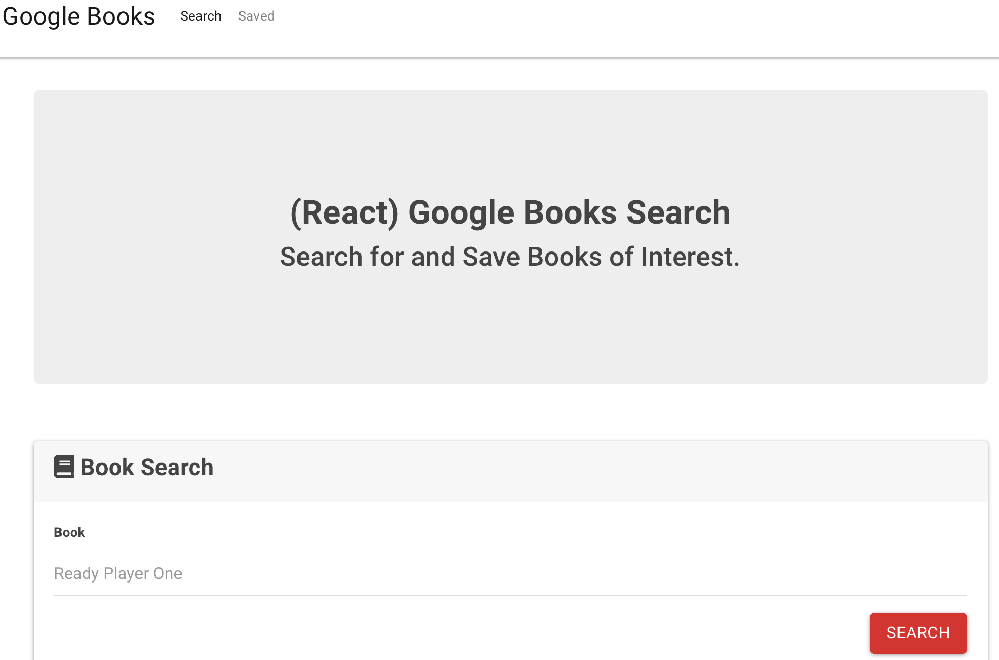

# Google Books Search

This repository houses the files that implement a React-based Google Book Search.

### Purpose

This application provides a means to search for Google Books. Once a book is found, it displays information about the book -- including a summary and the author's name -- and posts a link to the book. It also employs a database to allow users to store a list of books.

### Functionality

This application uses React to display components and to maintain state. It also uses a MongoDB database.

### Concepts and techniques
* React
* MongoDB

https://github.com/davidcbalsley/hw16-google-books-search

https://dcb-google-books.herokuapp.com/
